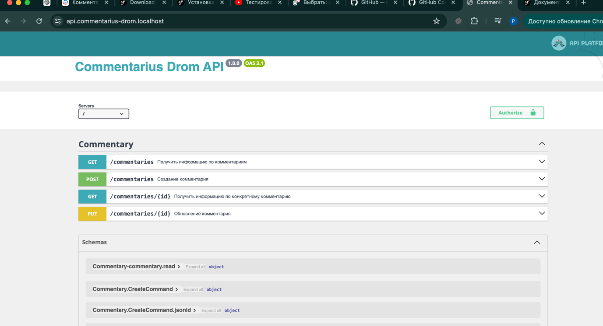

# Дром - сервис Commentarius 


## Подготовка локального окружения

Запускаем окружение:

```bash
m start
```
Устанавливаем зависимости:
```bash
m composer install
```
Поднимаем migrations:
```bash
m c d:m:m
```
Генерируем ssl-сертификат для traefik через [mkcert](https://github.com/FiloSottile/mkcert):
```bash
mkcert \
  -key-file docker/traefik/certs/key.pem \
  -cert-file docker/traefik/certs/cert.pem \
  commentarius-drom.localhost '*.commentarius-drom.localhost'
```

Запуск тестов:
```bash
m phpunit
```
Показываем API:


Показываем проходимость тестов:

